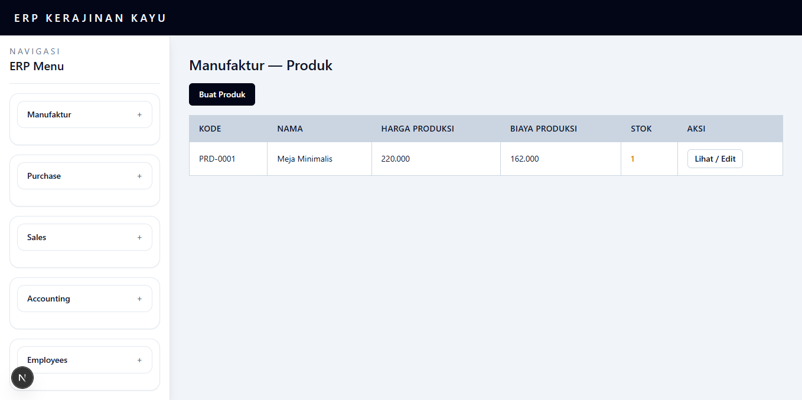
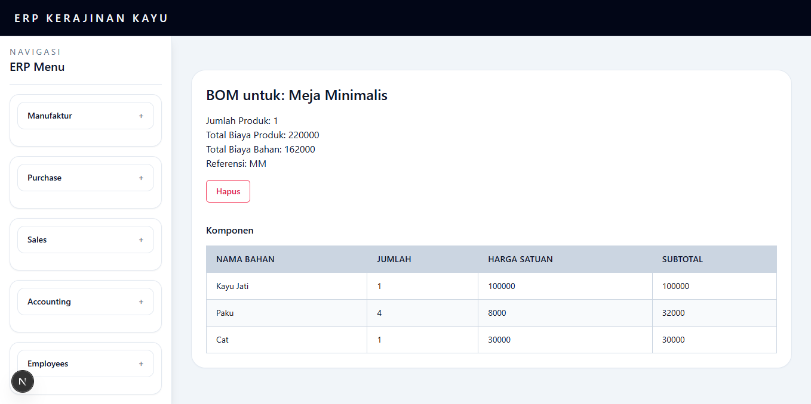
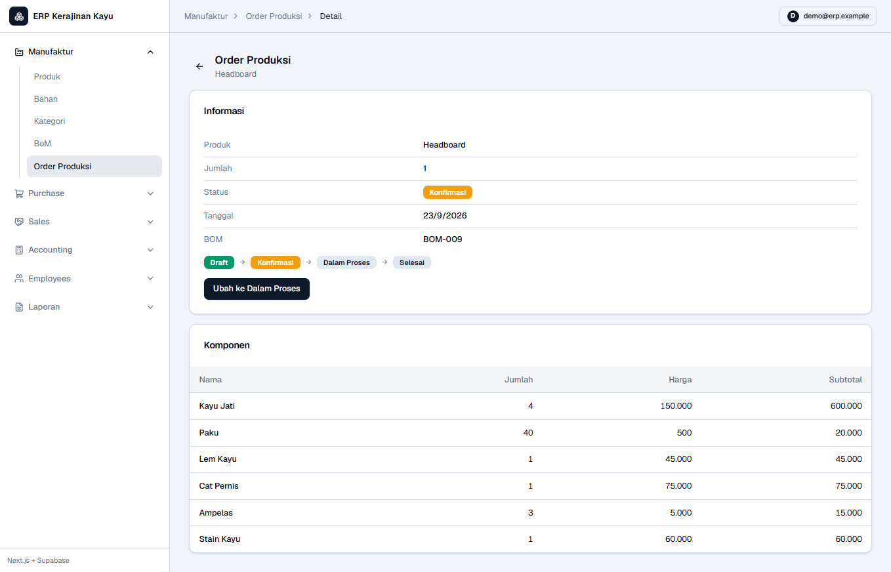
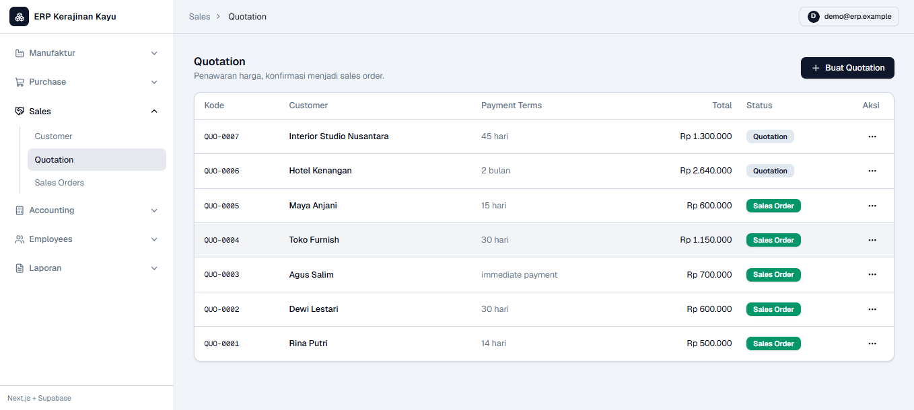
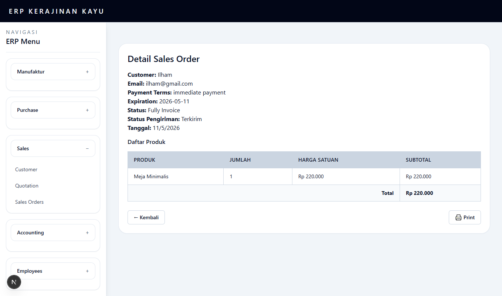

# ERP Kerajinan Kayu

Aplikasi ERP (Enterprise Resource Planning) untuk usaha kerajinan kayu, dibangun sebagai project portfolio. Rebuild dari aplikasi Laravel 8 + MySQL ke stack modern **Next.js 16 + Supabase**.

---

## 🚀 Tech Stack

| Layer      | Teknologi               |
| ---------- | ----------------------- |
| Frontend   | Next.js 16 (App Router) |
| Database   | Supabase (PostgreSQL)   |
| Auth       | Supabase Auth (Email)   |
| Styling    | Tailwind CSS            |
| Deployment | Vercel                  |

---

## 📦 Modul

### Manufaktur

- **Produk** — CRUD produk dengan kalkulasi stok otomatis
- **Bahan** — CRUD bahan baku dengan tracking stok
- **Kategori** — Kategorisasi produk
- **Bill of Materials (BOM)** — Daftar komponen per produk beserta total biaya
- **Order Produksi** — Flow: Draft → Konfirmasi → Dalam Proses → Selesai

### Purchase

- **Vendor** — CRUD data vendor
- **Bills** — Pencatatan tagihan vendor dengan flow pembayaran

### Sales

- **Customer** — CRUD data customer
- **Quotation** — Pembuatan penawaran harga
- **Sales Orders** — Konversi quotation → sales order → invoice

### Accounting

- **Customer Invoice** — Ringkasan invoice dari Sales Orders yang sudah Fully Invoice
- **Vendor Bill** — Ringkasan tagihan dari Bills yang sudah Paid

### Employees

- **Departemen** — Manajemen departemen
- **Karyawan** — CRUD data karyawan

---

## ⚙️ Setup Lokal

### 1. Clone Repository

```bash
git clone https://github.com/username/erp-kerajinan-kayu-nextjs.git
cd erp-kerajinan-kayu-nextjs/frontend
```

### 2. Install Dependencies

```bash
npm install
```

### 3. Setup Environment Variables

Salin file contoh dan isi dengan kredensial Supabase kamu:

```bash
cp .env.example .env.local
```

Isi `.env.local`:

```env
NEXT_PUBLIC_SUPABASE_URL=https://your-project.supabase.co
NEXT_PUBLIC_SUPABASE_ANON_KEY=your-anon-key
```

### 4. Jalankan Dev Server

```bash
npm run dev
```

Buka [http://localhost:3000](http://localhost:3000)

---

## 🗄️ Setup Supabase

### 1. Buat Project Supabase

Daftar atau login di [supabase.com](https://supabase.com), buat project baru.

### 2. Aktifkan Extension

Di Supabase SQL Editor, jalankan:

```sql
CREATE EXTENSION IF NOT EXISTS pgcrypto;
```

### 3. Jalankan Migration

Salin isi file `supabase/migrations/001_create_schema.sql` dan jalankan di Supabase SQL Editor.

### 4. Jalankan Seed

```bash
export SUPABASE_URL=https://your-project.supabase.co
export SUPABASE_SERVICE_ROLE_KEY=your-service-role-key
node scripts/seed_supabase.js
```

---

## 🔄 Demo Flow End-to-End

### Flow Produksi

1. Buat **Kategori** → Buat **Bahan** → Buat **Produk**
2. Buat **BOM** untuk produk (daftar komponen + jumlah)
3. Buat **Order Produksi** → Konfirmasi → Dalam Proses → Selesai
4. Stok produk otomatis bertambah ✅

### Flow Pembelian

1. Buat **Vendor** → Buat **Bill** dengan item bahan
2. Proses pembayaran bill → Status **Paid**
3. Stok bahan otomatis bertambah ✅

### Flow Penjualan

1. Buat **Customer** → Buat **Quotation**
2. Konfirmasi Quotation → otomatis jadi **Sales Order**
3. Proses pembayaran → Status **Fully Invoice**
4. Stok produk otomatis berkurang ✅

---

## 📸 Screenshots

### Dashboard Produk



### BOM



### Order Produksi



### Quotation



### Sales Orders



---

## ⚠️ Known Limitations

- Stok bahan bertambah saat Bill berstatus Paid (simplifikasi MVP — idealnya stok naik saat Goods Receipt setelah Purchase Order)
- Tidak ada fitur pembatalan (Cancel) untuk Order Produksi dan Sales Order
- Tampilan tabel belum optimal di layar mobile (< 768px) — direkomendasikan akses via desktop atau tablet landscape
- Modul Accounting hanya menampilkan ringkasan data, belum ada implementasi jurnal ganda
- Belum ada role-based access control (semua user authenticated memiliki akses penuh)
- Pagination belum diimplementasikan (semua data ditampilkan sekaligus)
- Stok produk dan bahan bisa bernilai minus jika order produksi atau penjualan melebihi stok yang tersedia — belum ada validasi stok minimum
- BOM tidak memiliki fitur edit — jika harga bahan berubah, total biaya di BOM tidak otomatis terupdate (idealnya: tambah fitur edit BOM atau snapshot harga saat Order Produksi dibuat)
- Tidak ada search/filter di halaman list
- Tidak ada notifikasi stok menipis

---

## 🗺️ Roadmap

- [ ] Flow RFQ → Purchase Order → Goods Receipt → Bill → Paid
- [ ] Fitur Cancel untuk Order Produksi & Sales Order
- [ ] Pagination pada halaman list
- [ ] Upload gambar produk & bahan via Supabase Storage
- [ ] Row Level Security (RLS) Supabase
- [ ] Laporan & rekap transaksi
- [ ] Export PDF / CSV

---

## 👤 Author

**Mochammad Rafi**  
Web Developer  
[GitHub](https://github.com/elemenpetir) | [LinkedIn](https://linkedin.com/in/davlilv)
